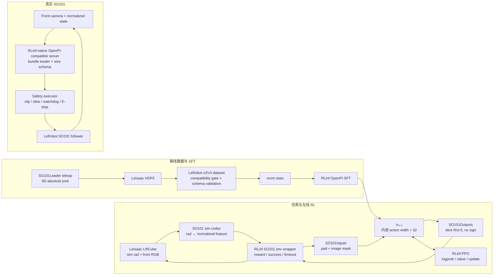

# RLinf × Isaac Lab × SO101 × π₀.₅ 最终开工文档

> 状态：Ready for kickoff ｜ 文档版本：v1.0 ｜ 日期：2026-07-26
>
> RLinf 代码基线：`9ca373c71d826d8669630f30c1f003a9174a2a9a`
>
> 第一目标任务：`LeIsaac-SO101-LiftCube-v0` ｜ 第一目标策略：OpenPI π₀.₅，先 SFT、后 PPO ｜ 第一目标动作协议：`so101_joint_abs_v1`

本文是两份 gap 分析的收敛版，也是可以直接拆 issue、排 PR、设 Go/No-Go 门槛的实施基线。后续如果接口选择发生变化，应先更新本文的“冻结契约”和版本清单，再改代码、数据或实验配置。

---

## 0. 一页结论

### 0.1 结论

这条链路是可行的，而且不需要重写 RLinf 的 RL 主干：

- RLinf 已经有可工作的 `Isaac Lab + π₀.₅ + PPO + FSDP + Ray` 路径。
- LeIsaac 已经有 SO101 资产、LiftCube 任务、SO101Leader 遥操作、数据转换和 OpenPI 远程推理客户端。
- 真正缺失的是一条 **SO101 专用的、端到端一致的接口与数据路径**：
  - 仿真弧度与 LeIsaac normalized motor feature 之间的 codec；
  - 6 维关节状态/动作的环境 wrapper；
  - SO101 专用 OpenPI transform、data config 与 norm stats；
  - 可加载到 RLinf 的 π₀.₅ SFT checkpoint；
  - reward、success、timeout、chunk、reset 的严格语义；
  - 实机侧的安全执行器和版本隔离。

因此，这不是“换一个 Isaac Lab task ID”级别的工作，也不是“从零支持新后端”。更准确的定义是：

> 在已有 RL 主干和已有 SO101 仿真任务之间，补齐一个机器人专用 vertical slice，并用数据、测试和统计评估证明它没有语义错位。

### 0.2 Gap 量级

| 交付目标 | 当前 gap | 合理日历时间 | 结论 |
| --- | ---: | ---: | --- |
| RLinf 能 reset/step SO101 LiftCube | 3/10 | 约 1 周 | 确定性工程为主 |
| π₀.₅ 在仿真中完成可信 SFT | 5/10 | 累计约 2–3 周 | 数据质量是主风险 |
| PPO 相对 SFT 有统计可信提升 | 5–6/10 | 累计约 2–4 周 | reward 与基线质量决定收敛 |
| checkpoint 通过服务跑到真实 SO101 | 7/10 | 再加约 2–4 周 | 控制安全与域差异为主 |
| 实机稳定、可重复、可扩展 | 8/10 | 再加约 2–6+ 周 | 不能由仿真接通自动推出 |

上述时间假设依赖、资产、训练 GPU、SO101Leader 和真实 SO101 均能及时使用。它不是对“完整实机效果”的 2–4 周承诺。

### 0.3 开工时必须接受的六个决定

1. MVP 使用 manager-based `LeIsaac-SO101-LiftCube-v0`，不从 DirectEnv 或自建任务起步。
2. 策略边界统一为 6 维绝对关节目标 `so101_joint_abs_v1`，夹爪连续，不做 `sign()`。
3. MVP 只使用前视相机；`wrist_images=None`，`num_images_in_input: 1`。
4. MVP `num_action_chunks: 1`；先绕开当前 Isaac Lab wrapper 的中途终止污染，再单独修 chunk。
5. 必须先通过 SFT Go/No-Go，才能开正式 PPO。
6. 实机先走 RLinf-native OpenPI-compatible server + 独立 LeRobot SO101 runtime；v1 不把 SO101 实机驱动塞进 RLinf env。

---

## 1. 范围与交付边界

### 1.1 本项目包含

- 将固定版本的 LeIsaac 作为 RLinf Isaac Lab 环境的 package 依赖。
- 注册并包装 `LeIsaac-SO101-LiftCube-v0`。
- 固定 SO101 状态、动作、相机、时序、奖励和终止协议。
- 固定 normalized policy contract；分别实现仿真 rad codec 与实机 calibration mapping。
- 采集并转换 6 维绝对关节示范数据。
- 用 RLinf 现有 FSDP VLA SFT 路径训练 π₀.₅。
- 用 RLinf 现有 embodied PPO 路径继续训练。
- 做 checkpoint 保存、重载、服务端、客户端、仿真评估的闭环验证。
- 在独立 runtime 上做真实 SO101 的低速安全 pilot。

### 1.2 v1 明确不包含

- 不把 LeIsaac task 复制或 vendor 到 RLinf/IsaacLab fork，除非兼容性 spike 证明 package 方式不可行。
- 不在 v1 添加腕部相机。
- 不在 v1 使用 7 维 EEF delta action。
- 不直接使用 LeIsaac state-machine 的 7 维 EEF 动作作为 π₀.₅ 训练标签。
- 不用正向 dense shaping reward 掩盖基础链路问题。
- 不在第一阶段实现 RLinf `SO101RealWorldEnv`。
- 不把 GR00T N1.7 放入 π₀.₅ 主路径；它只作为后续可选基线。
- 不承诺仅靠仿真 PPO 获得稳定 sim-to-real 成功率。

### 1.3 分段交付


M0–M3 是“可信仿真结果”的交付范围。M4 是独立的实机工程门槛，M5 是持续优化项目。

---

## 2. 两份报告的综合校准

两份报告对总体方向一致：RLinf 主干可复用，主要 gap 是 SO101 adapter、数据/SFT 和实机部署。以下细节经过当前 RLinf 代码和上游资料复核后，以本表为准。

| 议题 | 最终事实 | 对实施方案的影响 |
| --- | --- | --- |
| RLinf 是否已有 Isaac Lab + π₀.₅ PPO | 已有 Franka StackCube 的实现、示例和 E2E | 不新建 runner/algorithm，只扩展 env 与 OpenPI adapter |
| LeIsaac 是否支持 OpenPI | 已有通用 OpenPI 远程推理客户端 | 可复用 client 思路；但没有 SO101 LiftCube π₀.₅ checkpoint，也没有 RLinf PPO recipe |
| LiftCube 相机 | manager task 已使用 `TiledCameraCfg`；默认前视相机为 640×480、30 FPS，并删除腕部相机 | MVP 前视单相机，不安排“TiledCamera 改造”工作 |
| LiftCube reward | `RewardsCfg` 为空，但已有成功 termination `cube_height_above_base` | MVP 在 RLinf adapter 中从 success termination 生成 sparse reward，不修改 LeIsaac task reward |
| SO101 action config | task 模板初始 action cfg 为 `MISSING` | `gym.make()` 前必须调用 `env_cfg.use_teleop_device("so101leader")` 或等价的 RL 专用 6D action 配置 |
| LeIsaac 内部数值 | 仿真关节状态/目标使用弧度；数据转换按固定常量映射到 normalized motor feature | 必须有显式、可测试、版本化的 sim codec |
| state-machine 数据 | state-machine 使用的控制动作与 SO101Leader 的 6D joint action 不同，通常是 7D EEF pose + gripper | v1 只接受 SO101Leader 6D absolute 数据；除非明确重标注 joint target |
| LiftCube 腕部图像 | MVP task 没有腕部相机 | 不伪造有效腕部图像；OpenPI mask 必须将未使用视角置 false |
| RLinf Isaac Lab reward | `_calc_step_reward()` 存在但当前 `step()` 未调用；`success_once` 又由 `step_reward > 0` 推导 | 必须把 raw reward、success、termination、timeout 解耦 |
| chunk 行为 | 当前 `chunk_step()` 在某个 env 中途 done 后仍继续迭代剩余动作 | MVP 执行 horizon 固定为 1；后续用独立 PR 修复并测试 |
| 固定 reset ID | `update_reset_state_ids()` 当前是 no-op | 实现前不得声称固定场景评估；新配置先设为 false |
| 依赖版本 | 当前 RLinf 安装脚本从默认分支安装 RLinf/openpi 和 RLinf/IsaacLab | 第一项代码工作就是改成 SHA pin |
| PyTorch 基线 | 当前 RLinf/IsaacLab 2.3.0 的 x86 安装脚本与 LeIsaac 5.1 组合都指向 PyTorch 2.7.0 / torchvision 0.22.0 / CUDA toolkit 12.8.1（cu128） | 以该组合做兼容性 spike，不以未验证的 2.11 作为起点 |

---

## 3. 冻结架构

### 3.1 总体数据流



### 3.2 代码职责边界

| 层 | 负责 | 不负责 |
| --- | --- | --- |
| LeIsaac task | 资产、物理、传感器、成功 termination、原始 rad joint I/O | RLinf reward 聚合、OpenPI normalize、实机安全 |
| SO101 codec | 仿真 rad 与 `so101_joint_abs_v1` 双向转换、clip 与诊断 | 图像处理、PPO |
| RLinf env wrapper | task 注册、obs 包装、action decode、reward/success/timeout、metrics | 模型内部 padding |
| OpenPI transform | 数据 key 映射、模型内部 32 维 padding、图像 mask、输出 slice 6 | 仿真 rad、实机 motor bus |
| RLinf SFT/PPO | 参数训练、checkpoint、rollout、logprob/value | 机器人校准 |
| 实机 executor | 6 维 canonical action 到硬件、限位、速率限制、watchdog、急停 | 在线 PPO |

### 3.3 为什么选择 package 接入 LeIsaac

首选方式是在 RLinf 的 Isaac Lab 环境中安装固定 SHA 的 LeIsaac core package：

- 保留上游 SO101 task、资产和数据工具的来源关系。
- 避免维护第二份 LiftCube task。
- 避免同时安装 LeIsaac 自带的 stock IsaacLab 和 RLinf fork。
- 升级时可以做明确的兼容矩阵和 checksum 审计。

安装逻辑不得使用 LeIsaac 的 `[isaaclab]` extra；RLinf 已经负责安装自己的 IsaacLab fork。LeRobot 数据转换工具也应放到独立环境，避免转换器依赖改变训练环境。

---

## 4. 冻结接口契约

### 4.1 Canonical action/state：`so101_joint_abs_v1`

| 字段 | 契约 |
| --- | --- |
| 维度 | 6 |
| 顺序 | `shoulder_pan, shoulder_lift, elbow_flex, wrist_flex, wrist_roll, gripper` |
| state 语义 | 当前关节位置的 LeIsaac normalized motor feature |
| action 语义 | 下一控制时刻的绝对关节目标；不是 delta，不是 EEF pose |
| arm 协议范围 | `[-100, 100]`，由 `so101_joint_abs_v1` 固定 |
| gripper 协议范围 | `[0, 100]`，连续值，由 `so101_joint_abs_v1` 固定 |
| policy dtype | `float32` |
| simulator dtype | 由 Isaac Lab tensor 决定，codec 输出给 env 前转换到对应 dtype/device |
| 越界行为 | clip 到协议范围和仿真 joint limit，并累计 `action_clip_count`；不得静默 clip |
| 缺失/顺序错误 | fail fast |

硬规则：

- 不复用当前 `IsaacLabOutputs`，因为它会固定 slice `:7` 并对最后一维执行 `np.sign()`。
- 不在模型输出之后再做不透明的归一化。
- 数据、仿真和实机使用同一 policy contract、joint order、单位与绝对动作语义。
- 仿真 codec 固定复现 LeIsaac 的 USD joint-limit ↔ normalized motor-limit 映射，不读取某台真机的 calibration JSON。
- SO101Leader 数据源校准与部署 SO101Follower 校准是两个独立硬件身份；它们分别把 raw encoder 值映射到同一 canonical feature。
- 更换或重校准真实硬件不自动改变 policy contract version；只有 canonical 顺序、范围、单位或动作语义变化才升级协议。

### 4.2 Codec API

建议新增纯 Python/Torch 模块 `rlinf/envs/isaaclab/so101_codec.py`。它不能 import Isaac Sim，以便普通 CI 可运行测试。

建议最小接口：

```python
class SO101Codec:
    def encode_state(self, joint_pos_rad): ...
    def decode_action(self, normalized_target): ...
    def validate_mapping(self): ...
    def metadata(self) -> dict: ...
```

仿真 codec、数据源校准和部署校准必须分层记录：

| 层 | 输入/输出 | 版本身份 |
| --- | --- | --- |
| sim codec | Isaac Lab rad ↔ LeIsaac normalized motor feature | `sim_codec_version` + mapping checksum |
| dataset source | SO101Leader raw encoder ↔ normalized motor feature | `dataset_source_leader_calibration_id/checksum` |
| deployment | SO101Follower raw encoder ↔ normalized motor feature | `deployment_follower_calibration_id/checksum` |

三层通过 golden poses 和 round-trip 测试证明语义一致，不要求共享 calibration ID。

验收公差：

- 合法 joint rad 的 `decode(encode(rad))` 最大误差不超过 `1e-4 rad`。
- 合法 normalized feature 的 `encode(decode(feature))` 最大误差不超过 `1e-3 feature unit`。
- 边界、中心、随机样本和夹爪端点都必须覆盖。
- NaN、Inf、错误 shape、错误 joint name 必须抛出可定位错误。
- clip 前后的值、clip 次数和最大超限量必须可观测。

### 4.3 Observation schema

RLinf env wrapper 输出：

```python
{
    "main_images": front_rgb,
    "wrist_images": None,
    "extra_view_images": None,
    "states": canonical_joint_state_6d,
    "task_descriptions": ["Lift the red cube up."] * num_envs,
}
```

约束：

| 项 | 值 |
| --- | --- |
| 有效图像数 | 1 |
| 来源 key | LeIsaac observation group 的 `front` |
| 源图像 | RGB，默认 640×480，30 FPS |
| OpenPI image slot | `base_0_rgb` 有效；左右 wrist slot 无效且 mask=false |
| 配置 | `actor.model.openpi.num_images_in_input: 1` |
| 图像变换 | 数据、仿真评估、实机必须使用同一 resize/crop 逻辑 |

可以在吞吐测试后降低仿真分辨率，但必须同时更新 manifest 并重新验证数据/评估一致性；不能只改 PPO 配置。

### 4.4 OpenPI 维度契约

必须区分两种 action dimension：

| 维度 | 值 | 含义 |
| --- | ---: | --- |
| π₀.₅ 模型内部 action width | 32 | 保持 OpenPI 模型配置默认，不得改成 6 |
| 环境有效 action dim | 6 | 用于 loss/logprob 有效维度和最终输出 |

M0/M1 和第一条 PPO E2E 的 debug 配置必须显式包含：

```yaml
actor:
  model:
    action_dim: 6
    num_action_chunks: 1
    openpi:
      config_name: "pi05_isaaclab_so101_lift_cube"
      action_env_dim: ${actor.model.action_dim}
      num_images_in_input: 1
```

`SO101Inputs` 将 6 维 state/action pad 到模型内部宽度；`SO101Outputs` 只取前 6 维，不二值化夹爪。PPO 的扩散 logprob 仍在 RLinf 现有模型路径中计算，执行前的 deterministic affine codec 不改变需要训练的模型维度。

当前 RLinf 用同一个 `actor.model.num_action_chunks` 同时影响 SFT/PPO 有效 action chunk、rollout tensor shape 和 env 执行长度。不能把“prediction horizon 10、SFT 训练 10 步、仿真只执行 1 步”写成同一个配置：

- SFT 初始配置训练 10-step action chunk。
- M0/M1 env smoke 和第一条 PPO E2E 使用 1-step debug 配置。
- SO101-022 修复 chunk boundary 后，SO101-035 根据 server latency 冻结正式 chunk `N`。
- 正式 PPO 和实机评估使用同一个 `N`；如果从 1 改为 `N`，必须重新跑 SFT/PPO tensor、logprob 和闭环评估。

### 4.5 时序契约

必须先区分上游默认值和本项目的主动覆盖：

| 项 | 上游/初始值 | 本项目决定 |
| --- | ---: | --- |
| physics `dt` | `1/60 s` | 保持 |
| LeIsaac env decimation | 1 | 显式覆盖为 2 |
| low-level env/control rate | 上游默认 60 Hz | 数据采集、SFT/PPO 逻辑目标为 30 Hz |
| LiftCube front camera | 30 FPS | 保持 |
| env `step_dt` | 上游默认 `1/60 s` | 覆盖后必须为 `1/30 s` |
| π₀.₅ prediction horizon | upstream 默认 50 | 项目初始使用 RLinf Isaac Lab TrainConfig 的 10，并做 checkpoint/logprob 验证 |
| SFT training action chunk | config 相关 | 初始训练 10 |
| debug execution horizon | 无 | M0/M1 固定为 1 |
| 正式 execution horizon | 无 | M3 前根据延迟 profile 冻结 |
| episode budget | task/config 相关 | 初始 15 s，即 30 Hz 下最多 450 steps |

30 Hz 不是 LeIsaac 默认事实，而是项目为了让 camera、data action 和 control 对齐而做的显式 override。Phase 0 必须在 `gym.make()` 前设置 decimation，并运行时 assert `step_dt == 1/30`；随后重新验证动力学、成功判定、数据 FPS 和 replay。

时间对齐固定为：

- `obs_t` 使用时刻 `t` 最新的 front frame 和 joint state。
- `action_t` 是区间 `[t, t + 1/control_hz)` 的 absolute joint target。
- 数据 timestamp、frame index 和 action label 必须按这个规则构建。
- success 提前结束；timeout 使用 `max_episode_steps = episode_length_s * control_hz`。

仿真 debug 可以每个控制步查询一次 policy，而不要求 wall-clock 实时。真实机器人不能假设远程 π₀.₅ 每 33 ms 返回一次，因此 M3/M4 前还必须冻结：

- policy query rate；
- prediction horizon 与 execution horizon；
- server round-trip latency 的 p50/p95/p99 和最大容忍值；
- action buffer 的抢占规则；
- stale response 丢弃规则；
- buffer 耗尽、超时和断网时的 hold/stop 行为。

正式 PPO/eval 必须在仿真中复现最终选择的 query/execution/latency 合约。MVP `execution_horizon=1` 只是排错配置，不是默认实机方案。

### 4.6 Reward、success、failure、timeout

MVP 使用任务现有 success termination，不在 LeIsaac 中新增 dense reward。

| 信号 | 定义 |
| --- | --- |
| `success` | LiftCube 命名 success term `cube_height_above_base` 触发 |
| `failure` | v1 无单独失败条件，固定为 false；未来增加后必须独立上报 |
| `timeout` | truncation/time-out，且不是 success |
| `step_reward` | success 首次出现时为 `reward_coef`，其他时刻为 0 |
| `success_once` | 对显式 success 做 episode 内 OR，不再由任意正 reward 反推 |
| raw info | 保留 Isaac Lab 返回的信息，不得替换成空字典 |

建议在 `IsaaclabBaseEnv` 增加向后兼容 hooks：

```python
def _extract_outcomes(
    self, raw_reward, terminations, truncations, infos
): ...

def _compute_step_reward(
    self, raw_reward, success, failure, timeout, infos
): ...

def _prepare_actions(self, actions): ...
```

默认实现保持现有 Franka 行为；SO101 wrapper 覆盖上述方法。这样可以复用现有 `_calc_step_reward()`，同时避免把 SO101 逻辑写进通用 `action_utils.py`。

SO101 wrapper 还必须在启动时断言 termination term 集合与已审计版本一致。MVP 可在“唯一非 timeout termination 就是 `cube_height_above_base`”的断言下使用聚合 `terminations`；更稳妥的实现是从 `TerminationManager` 读取命名 term。不得把未来新增的任意 failure termination 自动解释成 success。

### 4.7 Chunk 与 reset

当前 `IsaaclabBaseEnv.chunk_step()` 会继续执行完整 chunk，即使某些环境已经 done。这可能把剩余动作施加到终止后或内部自动重置的新 episode。

MVP 约束：

- `num_action_chunks: 1`。
- `use_fixed_reset_state_ids: false`。
- 训练和评估都记录每个 episode 的 seed、success、timeout 和长度。

后续 chunk 修复的验收要求：

- 每个 env 在第一个 done 之后，后续 chunk reward/logprob mask 为 0。
- 不把 reset 后 observation 计入前一 episode。
- 不把剩余动作当作下一 episode 的有效动作。
- `final_observation`、`final_info` 和 done mask 一致。
- 修复后再基准比较 execution horizon 1、2、4、5。

---

## 5. 版本、环境与产物策略

### 5.1 已知兼容基线

| 组件 | 开工基线 | 说明 |
| --- | --- | --- |
| RLinf | `9ca373c71d826d8669630f30c1f003a9174a2a9a` | 本文审计基线 |
| LeIsaac | v0.4.0 / `1651c321e9b0c1bb54233211fc7b3cd70d8373d5` | package 方式接入 |
| RLinf/IsaacLab | 版本 2.3.0；具体 SHA 在 SO101-001 冻结 | 当前安装脚本尚未 pin |
| Isaac Sim | 5.1.0 | 与 LeIsaac 2.3.0 兼容表一致 |
| Python | 3.11 | sim/train |
| CUDA toolkit / wheel channel | 12.8.1 / cu128 | x86 基线 |
| PyTorch | 2.7.0 | x86 基线 |
| torchvision | 0.22.0 | x86 基线 |
| RLinf/openpi | 具体 SHA 在 SO101-001 冻结 | 必须使用 RLinf fork 完成训练 |
| LeIsaac OpenPI client | 随 LeIsaac v0.4.0 commit 固定 | client 实现在 LeIsaac 中，不是独立的 5bff package |
| upstream OpenPI server 参考 | `5bff19b0c0c447c7a7eaaaccf03f36d50998ec9d` | LeIsaac 验证过的服务端参考；不能假设可直接加载 RLinf checkpoint |
| LeRobot dataset 格式 | 优先 spike v3；失败则 v2 或补 adapter | 必须先通过 RLinf/OpenPI loader gate |
| LeRobot v3 converter candidate | LeRobot 0.4.2 + NumPy 1.26.0 | SO101-001 冻结完整 commit/wheel hash |
| GR00T N1.7 可选基线 | `23ace64f17aa5015259b8609d371eb61a357c776` | 不在主路径 |

### 5.2 三个隔离环境

| 环境 | 组件 | 原因 |
| --- | --- | --- |
| `rlinf-so101-train` | RLinf、RLinf/openpi、RLinf/IsaacLab、LeIsaac core | 唯一训练/仿真环境；不安装 LeIsaac `[isaaclab]` extra |
| `leisaac-converter` | 固定 LeIsaac、选定并 pin 的 LeRobot、NumPy 1.26.0 | v2/v3 转换与兼容性验证；避免训练依赖被 converter 改写 |
| `so101-runtime` | 选定并 pin 的 client、固定 LeRobot SO101 driver、安全 executor | 实机控制独立升级、独立回滚 |

### 5.3 依赖安装原则

`requirements/install.sh` 当前对 RLinf/openpi 和 RLinf/IsaacLab 使用未固定默认分支，而且 `clone_or_reuse_repo()` 会直接复用已有 checkout。仅增加 commit 常量并不能实现可复现安装。开工 PR 必须：

- 增加显式的 RLinf/openpi、RLinf/IsaacLab、LeIsaac commit 常量。
- 对 pip git dependency 使用 `@<SHA>`，并核验安装 metadata 的 commit。
- 为 IsaacLab 实现 commit-aware clone/reuse：
  - 新目录应 fetch 精确 SHA 并 detached checkout；
  - 现有目录必须验证 remote、clean worktree 和 `HEAD == expected_sha`；
  - 用户通过 `ISAAC_LAB_PATH` 提供的 checkout 若不匹配，应 fail fast，不自动 checkout 或覆盖用户改动；
  - 默认托管目录若不匹配也应明确失败或使用 commit-specific 新目录，不能静默复用；
  - 不能假设默认 `--depth 1` clone 包含任意 SHA。
- 用 LeIsaac core package，不安装其 `[isaaclab]` extra。
- 对选定的 LeRobot converter 记录完整 commit 或 wheel hash。
- 在安装结束打印并校验最终 SHA、Python、torch、CUDA、Isaac Sim、Isaac Lab 版本。
- 在 Docker stage 与 E2E 中复用同一组锁定值。
- CI 不允许从 floating `main` 获取核心仿真/模型依赖。

建议的 LeIsaac requirement 形态：

```text
leisaac @ git+https://github.com/LightwheelAI/leisaac.git@1651c321e9b0c1bb54233211fc7b3cd70d8373d5#subdirectory=source/leisaac
```

### 5.4 Artifact manifest

每个可评估 checkpoint 必须随附一个 manifest。建议新建：

`artifacts/so101_liftcube/manifest.yaml`

至少记录：

```yaml
schema_version: 1
stage: training
core:
  policy_contract: so101_joint_abs_v1
  joint_order: [...]
  physics_hz: 60
  control_hz: 30
  camera_hz: 30
  prediction_horizon: 10
  camera_schema: {...}
  rlinf_commit: ...
  rlinf_openpi_commit: ...
  isaaclab_commit: ...
  leisaac_commit: ...
  isaac_sim_version: ...
  torch_version: ...
  dataset_repo_or_path: ...
  dataset_revision: ...
  dataset_format: ...
  dataset_info_sha256: ...
  norm_stats_sha256: ...
  openpi_config_name: pi05_isaaclab_so101_lift_cube
  asset_id: ...
  norm_stats_relative_path: assets/<asset_id>/norm_stats.json
  sim_codec_version: ...
  sim_codec_sha256: ...
  dataset_source_leader_calibration_id: ...
  dataset_source_leader_calibration_sha256: ...
  canonical_joint_limits: ...
  so101_usd_sha256: ...
  checkpoint_sha256: ...
serving: null
deployment: null
```

manifest 采用阶段化必填：

| `stage` | 何时生成 | 附加必填 |
| --- | --- | --- |
| `training` | SO101-033 packager | 上述 `core` 全部字段 |
| `serving` | SO101-034/035 | `serving_implementation`、client implementation/commit、policy query rate、execution horizon、latency budget/profile、wire golden checksum |
| `deployment` | SO101-050 | follower calibration ID/checksum、robot serial、hardware safety limits、camera device/intrinsics |

manifest 只有在其声明 stage 的条件字段完整时才合法。M2 的训练/bundle 测试不要求提前填写真实 follower；正式 server eval 需要 `serving` stage，实机只接受 `deployment` stage。stage promotion 不能改写已有 core checksum。

### 5.5 Checkpoint bundle 的唯一合法布局

当前 RLinf OpenPI loader 识别 `model_state_dict/full_weights.pt` 或 `actor/model_state_dict/full_weights.pt`；SFT 保存逻辑不会自动复制 norm stats。因此本项目固定 runner-style bundle：

```text
so101_pi05_bundle/
├── actor/
│   └── model_state_dict/
│       └── full_weights.pt
├── assets/
│   └── <asset_id>/
│       └── norm_stats.json
├── configs/
│   └── resolved.yaml
├── eval/
│   ├── seeds.json
│   └── report.json
└── manifest.yaml
```

norm stats 配置必须按运行角色设置：

| 场景 | 配置/加载位置 |
| --- | --- |
| SFT 与 PPO training | `actor.model.openpi_data.norm_stats_path`；PPO 的 train-time rollout 会使用 actor model config |
| standalone embodied eval | `rollout.model.openpi_data.norm_stats_path` |
| RLinf-native server | 从 bundle manifest 的 `core.norm_stats_relative_path` 解析，并核验 checksum |

`calculate_norm_stats.py` 的输出位置可能跟随 dataset path；packager 必须把已校验的同一份 stats 复制到上述布局。任何角色都不得依赖开发机外部 assets。

---

## 6. 代码改动地图

下列“新增”路径是提案，不代表当前仓库已经存在。

| 路径 | 状态 | 改动 |
| --- | --- | --- |
| `requirements/install.sh` | 修改 | commit-aware fetch/checkout/verify；pin RLinf/openpi、RLinf/IsaacLab 和 LeIsaac core |
| `docker/Dockerfile` | 修改 | 增加/扩展 SO101 Isaac Lab + OpenPI 构建 stage |
| `rlinf/envs/isaaclab/so101_codec.py` | 新增 | 纯 sim codec、固定 mapping 校验、metadata |
| `rlinf/envs/isaaclab/isaaclab_env.py` | 修改 | action、outcome、reward hooks；保留 raw infos |
| `rlinf/envs/isaaclab/tasks/so101_lift_cube.py` | 新增 | task 注册、`use_teleop_device("so101leader")`、obs/action codec |
| `rlinf/envs/isaaclab/__init__.py` | 修改 | 注册 `LeIsaac-SO101-LiftCube-v0` |
| `rlinf/models/embodiment/openpi/policies/so101_policy.py` | 新增 | 单相机 `SO101Inputs`、连续 6D `SO101Outputs` |
| `rlinf/models/embodiment/openpi/dataconfig/so101_dataconfig.py` | 新增 | spike 选定的 LeRobot v2/v3 key 映射与 schema |
| `rlinf/models/embodiment/openpi/dataconfig/__init__.py` | 修改 | 注册 `pi05_isaaclab_so101_lift_cube` |
| `examples/embodiment/config/env/isaaclab_so101_lift_cube.yaml` | 新增 | 环境契约 |
| `examples/sft/config/isaaclab_so101_lift_cube_sft_openpi_pi05.yaml` | 新增 | RLinf FSDP SFT |
| `examples/embodiment/config/isaaclab_so101_lift_cube_ppo_openpi_pi05.yaml` | 新增 | PPO 正式配置 |
| `evaluations/isaaclab/isaaclab_so101_lift_cube_openpi_pi05_eval.yaml` | 新增 | 200 fixed seeds standalone eval；在 `rollout.model` 配置 bundle/stats |
| `tests/unit_tests/test_so101_codec.py` | 新增 | codec round-trip、边界、异常 |
| `tests/unit_tests/test_so101_openpi_transform.py` | 新增 | 单相机 mask、padding、6D continuous output |
| `toolkits/so101/package_openpi_checkpoint.py` | 新增 | 生成唯一 bundle 布局，复制 stats/config/manifest 并验 checksum |
| `toolkits/so101/serve_openpi_policy.py` | 新增 | RLinf-native OpenPI-compatible server，直接读取 RLinf bundle |
| `tests/e2e_tests/sft/isaaclab_so101_sft_openpi_pi05.yaml` | 新增 | 两步 SFT 配置，保存 checkpoint |
| `tests/e2e_tests/sft/run_so101_sft_save_reload.sh` | 新增 | 两进程 save→resume，再 package→loader forward |
| `tests/e2e_tests/embodied/isaaclab_so101_ppo_openpi_pi05.yaml` | 新增 | 一步 PPO 配置，覆盖 `value_after_vlm: true` |
| `tests/e2e_tests/embodied/run_so101_ppo_save_reload.sh` | 新增 | 两进程 PPO save→resume→eval |
| `tests/e2e_tests/so101/test_openpi_wire_schema.py` | 新增 | fixed seed/noise 的 direct/server/client golden test |
| `artifacts/so101_liftcube/manifest.yaml` | 新增 | 版本、schema、校准、数据和 checkpoint 指纹 |

不建议为 MVP 修改 `rlinf/envs/action_utils.py` 的 OpenPI Isaac Lab 分支。SO101 codec 属于具体 robot/task wrapper，通用层只负责 tensor 类型转换。

---

## 7. Issue 拆分与依赖

估时是有效工程日，不包含排队、下载大资产、训练 GPU 等待和实机故障。

| ID | 任务 | 依赖 | 估时 | 主要产物 | 验收 |
| --- | --- | --- | ---: | --- | --- |
| SO101-000 | 冻结契约与 manifest schema | 无 | 0.5–1d | 本文、manifest 模板 | M0/M1 joint/camera/reward/timing 固定；M3/M4 延迟项有 owner 和 gate |
| SO101-001 | 依赖、dataset loader 兼容性与真实 SHA pin | 000 | 2–3d | commit-aware install、v2/v3 选择、版本报告 | convert→load batch→norm stats→1-step SFT；HEAD/hash 可复现 |
| SO101-002 | SO101/Table-with-Cube 资产锁定 | 001 | 0.5–1d | asset source、license、checksum | 干净机器可解析全部 USD |
| SO101-010 | 实现纯 SO101 codec | 000 | 1–2d | codec + unit tests | round-trip、公差、clip、错误输入全过 |
| SO101-011 | 数据 schema/action-align validator | 001,010 | 1d | validator + fixture | `*.pos` 名称、顺序、单位、范围、`action_align=true` 不一致时 fail fast |
| SO101-020 | 接入 LeIsaac task 与 SO101 wrapper | 001,002,010 | 2–3d | env wrapper、注册、config | 4 env reset/step 1000 步无 NaN |
| SO101-021 | reward/outcome hooks | 020 | 1–2d | base hooks + SO101 override | success、timeout、reward impulse 精确 |
| SO101-022 | chunk/reset 语义修复 | 021 | 2–3d | active mask/final info tests | done 后无跨 episode 污染 |
| SO101-023 | 固定评估 seed/reset state | 020 | 1–2d | deterministic eval path | 重跑同 seed 初态与 outcome 可复现 |
| SO101-030 | OpenPI SO101 transform/data config | 001,010,011 | 2–3d | policy transform、TrainConfig | 单相机 mask、32→6 维、horizon/logprob 正确 |
| SO101-031 | 采集并转换 v1 数据集 | 011,020 | 3–7d | 200–500 成功 episode | 100% schema 合法、回放通过 |
| SO101-032 | norm stats 与 RLinf SFT | 030,031 | 2–5d | stats、SFT checkpoint | 可保存、重载、推理 |
| SO101-033 | checkpoint packager 与 bundle validator | 032 | 1–2d | packager、bundle、loader test | weights/stats/config/manifest 可离线重载 |
| SO101-034 | RLinf-native OpenPI server 与 wire golden | 030,033 | 2–4d | server、selected client pin、golden test | SFT/PPO bundle 可服务；fixed noise parity |
| SO101-035 | query/execution/latency 合约 | 022,034 | 1–2d | p50/p95/p99 profile、buffer spec | 仿真与实机闭环参数冻结 |
| SO101-036 | standalone 固定种子评估 | 023,033,034,035 | 1–2d | eval config、200-seed 报告 | `rollout.model` 从 bundle/stats 加载；通过 M2 Go/No-Go |
| SO101-040 | PPO config 与两阶段 E2E | 021,030,036 | 2–3d | config、save/restart/reload harness | rollout/update/save 后第二进程 resume/eval |
| SO101-041 | 正式 PPO 与统计评估 | 022,023,035,040 | 3–7d | 3 seed 曲线和报告 | 通过 M3 Go/No-Go |
| SO101-050 | 实机 policy client 与安全 executor | 034,035,036 | 5–10d | 独立 runtime | watchdog、限位、急停测试通过 |
| SO101-051 | 低速实机 pilot 与 sim-to-real 校准 | 041,050 | 5–10d | pilot 报告 | 无安全事故；记录真实成功率 |
| SO101-060 | GR00T N1.7 SO101 可选基线 | 020,031 | 3–6d | converter/config/E2E | 与 π₀.₅ 使用同一 eval protocol |

### 7.1 建议 PR 切分

1. **PR 1 — contract + codec**：SO101-000、010、011。纯单测，不依赖 Isaac Sim。

2. **PR 2 — dependencies + environment smoke**：SO101-001、002、020。要求可复现安装、asset、task reset/step 和 schema。

3. **PR 3 — reward + termination + reset semantics**：SO101-021、022、023。保持 Franka regression 通过。

4. **PR 4 — OpenPI + data + SFT + serving**：SO101-030 至 036。

5. **PR 5 — PPO + E2E + docs**：SO101-040、041；同时使用 RLinf 的 install/Docker/CI 和 example-doc 流程。

6. **PR 6 — deployment runtime**：SO101-050、051。与训练环境独立发布。

---

## 8. 里程碑与 Go/No-Go

### M0：兼容性和契约冻结

目标：证明依赖能共存，且所有团队成员在训练前使用同一个接口。

必须通过：

- 安装环境只存在一份 Isaac Lab，版本为 2.3.0。
- 所有 git 依赖的 clean `HEAD` 和所有 wheel hash 与 lock manifest 完全一致。
- SO101 与 Table-with-Cube 资产可在干净机器解析，source/license/checksum 已记录。
- LeIsaac 在 `AppLauncher` 初始化后被 import 并注册 task。
- `env_cfg.use_teleop_device("so101leader")` 后 action space 为 6。
- 显式覆盖 decimation=2；运行时 assert `step_dt=1/30`、图像 key/shape、joint name/order。
- v3 candidate 完成 convert → RLinf dataset instantiate → one batch → norm stats → 1-step SFT；否则明确选择 v2 或实现 adapter。
- `action_align=true` 被硬校验，state/action 都落在 normalized motor feature 范围。
- codec unit tests 全部通过。

No-Go：

- 同一 venv 出现两份 Isaac Lab。
- checkout dirty、HEAD/hash 不匹配或仍依赖 floating `main`。
- action space 不是 6，或 gripper 仍被二值化。
- 需要修改 RLinf PPO 主循环才能完成基础 step。
- sim mapping、leader calibration、follower calibration 仍被混成一个身份。
- 选定 dataset 格式无法被 RLinf/OpenPI 稳定加载。

### M1：仿真环境闭环

目标：不依赖模型，证明 SO101 wrapper 的动力学、观测和 episode 语义正确。

必须通过：

- 4 个并行 env 连续 1000 step，obs/action/reward 全部 finite。
- hold action 不产生异常跳变；边界 action 受到显式 clip。
- scripted/teleop 成功恰好产生一次正 reward。
- timeout 不计 success。
- 启动时能确认命名 success term 是 `cube_height_above_base`；termination term 集合变化时 fail fast。
- `infos` 中可区分 success、failure、timeout、episode length、clip count。
- MVP `num_action_chunks=1` 下没有跨 episode action。
- 录制视频与数值日志能对应。

### M2：SFT Go/No-Go

目标：获得不是纯随机探索的 π₀.₅ 起点。

数据要求：

- 首批目标 200–500 个成功 episode；这只是启动量，不保证足够。
- 只接受 SO101Leader 6D absolute trajectory，或经过可审计重标注的 6D joint target。
- 数据集 100% 通过 `*.pos` feature name、joint order、shape、dtype、finite、FPS、image key、normalized range 和 `action_align=true` 检查。
- 随机抽取至少 20 个 episode 在 LeIsaac 回放，action/state 对齐。
- norm stats 与 dataset revision 绑定。

评估要求：

- 使用固定的 200 个 eval seeds。
- success 至少 5%，即 `>=10/200`。
- 100% action finite。
- 无持续 joint-limit collision。
- 第一进程保存后，由第二进程从 `runner.resume_dir` 恢复训练状态；另从自包含 bundle 加载模型并 forward。
- 所有加载路径显式使用 bundle 内的 `openpi_data.norm_stats_path`。
- RLinf-native server 能加载不带/带 value head 的 SFT/PPO bundle，并只暴露 policy action。
- direct policy → server → selected client 使用相同观测、固定 RNG/noise 后，输出在数值公差内一致。

未达到 5% 时停止正式 PPO，优先排查：

1. joint order、单位、绝对/相对语义；
2. norm stats 与 checkpoint 是否匹配；
3. 数据集是否包含 7D state-machine action；
4. 图像视角、resize/crop、语言指令；
5. 数据覆盖与示范质量。

### M3：PPO Go/No-Go

目标：证明 RL 不是只“能跑”，而是相对 SFT 有可信收益。

工程门槛：

- 两阶段 E2E：第一进程完成 rollout → reward → advantage → actor/value update → save；第二进程 resume 后再 update/eval。
- 新 E2E 必须覆盖生产配置 `value_after_vlm: true`，不能只覆盖当前 Franka E2E 的 false 分支。
- 正式实验前已冻结 policy query rate、execution horizon、latency/buffer 合约，并在仿真中复现。
- reward 分布、KL、entropy、value loss、clip fraction、success/timeout 都有日志。
- 无 NaN、无 action 越界失控、无跨 episode reward。

性能门槛：

- 用与 SFT 相同的 200 个 fixed seeds 做 paired evaluation。
- 至少 3 个独立 PPO training seeds。
- 至少 2/3 个训练 seed 的最终成功率高于对应 SFT baseline。
- 工程目标为平均绝对提升 `>=5 percentage points`。
- 对 paired success difference 做 bootstrap；正式“通过”要求 95% CI 下界大于 0。
- 安全指标和 action clip rate 不退化。

如果只完成一条训练曲线或只看 train reward，结论只能是“PPO 管线可运行”，不能写“PPO 有效”。

### M4：真实 SO101 安全 pilot

目标：验证同一 canonical contract 能驱动真实机器人，不把它等同于稳定 sim-to-real。

必须通过：

- 独立 LeRobot runtime 读取相同 policy contract/joint order，并分别校验 deployment follower calibration 和 robot serial。
- 选定 client commit 与 RLinf-native server 的 wire-schema golden test 通过。
- 速度/步进幅度限制、位置限位、通信 watchdog、超时 hold、人工 E-stop 都有测试。
- 首次上电不接触物体，低速执行中心位姿和小幅动作。
- chunk 可中断；急停不能等待整个 action horizon。
- action buffer 支持抢占；stale response 丢弃；buffer underrun/断网进入 hold/stop。
- 记录相机时间戳、policy query、p50/p95/p99 latency、motor latency、target、actual、clip 和 fault。
- 在有人工监护的条件下完成不少于 20 次 task attempt，并报告真实成功率和失败类型。

M4 的通过表示“可以安全评估”，不表示达到生产级成功率。

---

## 9. 数据与 SFT 实施细节

### 9.1 数据 v1 规则

优先候选是 LeRobot Dataset v3，但只有 SO101-001 的端到端 loader gate 通过后才能冻结；否则使用 v2 或补兼容 adapter。选定格式的 LeRobot commit/wheel hash 必须进入 manifest。每个样本至少包含：

- `observation.images.front`
- `observation.state`
- `action`
- task/language instruction
- episode/frame/timestamp 信息

schema validator 必须从 dataset metadata 读取 feature names，并逐字比对：

```text
shoulder_pan.pos
shoulder_lift.pos
elbow_flex.pos
wrist_flex.pos
wrist_roll.pos
gripper.pos
```

上述是 LeRobot metadata 的 feature names；adapter 再把它们映射到内部 bare joint order。不能只检查 shape 为 6，因为“顺序错但维度对”是最危险的静默错误。

LeIsaac converter 必须启用并记录 `action_align=true`。它总会转换 `observation.state`，但 action 只有在 action alignment 开启时才转换；关闭时可能出现 state 是 normalized motor feature、action 仍是 rad/EEF 的静默错配。validator 除了 metadata，还必须检查 6 维 action 的范围和 20-episode replay。

### 9.2 不直接使用 state-machine action

LeIsaac 的 SO101Leader device 产生 5 个 arm joint absolute target + 1 个 gripper absolute target，符合本项目的 canonical action。

而 keyboard/gamepad/state-machine 可能走 EEF/IK action 配置，动作通常不是同一 6D 语义。可以使用它们生成场景或轨迹，但进入 v1 数据集前必须：

- 从每一步实际 joint target 重建 6D absolute label；
- 通过 codec 和回放测试；
- 在 dataset metadata 中标记 relabel 版本。

做不到这三点就不混入 v1。

### 9.3 SFT 路径

优先使用 RLinf 已有 `FSDPVlaSftWorker`：

- 直接读取新的 OpenPI data config。
- 从 π₀.₅ base checkpoint 开始。
- SFT 配置使用 `action_horizon: 10`、`num_action_chunks: 10`，训练全部 10 个标签步。
- runner 保存到 `global_step_<N>/actor/model_state_dict/full_weights.pt`，由当前 RLinf OpenPI wrapper 读取。
- 避免增加 JAX → PyTorch checkpoint 转换步骤。

通用 SFT save 不会自动复制 norm stats，因此 SO101-033 必须按 [5.5](#55-checkpoint-bundle-的唯一合法布局) 打包。所有消费者显式设置 `openpi_data.norm_stats_path`，并从 bundle 内读取 weights、stats、resolved config、dataset revision、eval seeds/report 和 manifest。

---

## 10. PPO 实施细节

### 10.1 第一版配置

下列是 debug/E2E 配置，不是最终实机 chunk 配置：

- `model_type: openpi`
- `action_dim: 6`
- `num_action_chunks: 1`
- `openpi.action_env_dim: 6`
- `openpi.num_images_in_input: 1`
- `openpi.value_after_vlm: true`
- `openpi_data.norm_stats_path: <bundle>/assets/<asset_id>/norm_stats.json`
- `loss_type: actor_critic`
- `adv_type: gae`
- sparse success reward
- `use_fixed_reset_state_ids: false`，直到 SO101-023 合并

项目初始 `action_horizon: 10` 来自 RLinf 的现有 Isaac Lab π₀.₅ TrainConfig；它不是 upstream π₀.₅ 默认值。SO101-030 必须验证 base checkpoint load、32 维 padding/mask、10-step tensor shape 和 PPO logprob 对齐。

其他超参先复制现有 Franka π₀.₅ Isaac Lab 配置，只有在日志证明不合适时再调整。不要在第一条可运行曲线之前同时修改 reward、action horizon、KL、value head 和图像配置。

### 10.2 实验顺序

1. 4 env、1 rollout、1 update 的 E2E。
2. 小规模 overfit：固定少量 seeds，确认 reward/value 能学习。
3. 固定 SFT checkpoint 和 200 eval seeds，跑 PPO seed 0。
4. 通过趋势检查后再跑 seed 1、2。
5. 完成 paired evaluation 和 bootstrap。
6. 完成 SO101-022/036，选择正式 chunk `N`，用相同闭环重跑 PPO 与 eval。
7. 再讨论环境数、学习率和其他吞吐优化。

### 10.3 必看指标

| 类别 | 指标 |
| --- | --- |
| task | train/eval success、timeout、episode length、return |
| action | mean/std/min/max、clip rate、joint-limit proximity |
| PPO | policy loss、value loss、KL、entropy、ratio、clip fraction |
| diffusion | denoising/logprob finite rate、noise level |
| runtime | env FPS、policy latency、GPU memory、reset time |
| data integrity | episode boundary violations、post-done masked steps |

---

## 11. 实机部署架构

### 11.1 v1 方案

训练侧输出 [5.5](#55-checkpoint-bundle-的唯一合法布局) 定义的 bundle。推理机运行本项目新增的 RLinf-native OpenPI-compatible server，它复用 RLinf OpenPI loader 读取 FSDP `.pt`、SO101 transform 和 norm stats，并忽略 policy inference 不需要的 value-head 输出。

机器人机使用固定 commit 的 upstream `packages/openpi-client` wire protocol 和 LeRobot SO101 driver。初始 client 基线取 LeIsaac 已验证的 upstream OpenPI commit `5bff19b0c0c447c7a7eaaaccf03f36d50998ec9d`，但必须由 SO101-034 的 golden test 证明与 RLinf-native server 兼容。若改用 LeIsaac v0.4.0 内置 client，必须在 manifest 中改写 implementation/commit 并重跑同一测试。

实机 client 的输入仍是：

- front RGB；
- `so101_joint_abs_v1` state；
- task prompt。

输出仍是：

- `so101_joint_abs_v1` absolute target。

只在 safety executor 中通过 deployment follower calibration 把 canonical target 映射到 raw motor command。这样仿真 wrapper 和真实 executor 共享 policy contract，而不是共享 Isaac Lab 代码或 calibration 文件。

### 11.2 必须有的安全层

- 物理 joint position limit。
- 每步最大 target delta。
- 速度/加速度或 slew-rate limit。
- gripper force/current 限制。
- 带时间戳的异步 action buffer；只接受最新、未过期响应。
- buffer underrun 或通信超时后 hold/stop，不盲目重放旧 chunk。
- 新响应可抢占旧 chunk。
- action chunk 可中断。
- 进程 watchdog。
- 明确、可触达、独立于推理进程的 E-stop。
- 启动时 deployment follower calibration ID/checksum 和 robot serial 校验。
- 低速模式和 dry-run 模式。
- 全量 target/actual/fault 日志。

### 11.3 sim-to-real 后续项

- 相机外参与视角对齐。
- 光照、纹理、物体尺寸/质量/摩擦随机化。
- 关节零点、backlash、延迟和控制带宽建模。
- 真实 SO101 少量示范或失败回流。
- 必要时做 sim + real 混合 SFT，再从新的 SFT baseline 评估 RL 增益。

---

## 12. 可执行命令

以下命令分为“当前已存在”和“对应 PR 合并后”。不要在新配置文件尚未创建时把后者当成当前可运行命令。

### 12.1 当前已存在

安装现有 OpenPI + Isaac Lab 环境：

```bash
bash requirements/install.sh embodied --model openpi --env isaaclab
```

计算 OpenPI norm stats 的现有入口：

```bash
python toolkits/lerobot/calculate_norm_stats.py \
  --config-name <openpi_config_name> \
  --repo-id <local_path_or_hf_repo_id>
```

运行现有 VLA SFT：

```bash
bash examples/sft/run_vla_sft.sh <config_name>
```

运行现有 embodied training：

```bash
bash examples/embodiment/run_embodiment.sh <config_name>
```

### 12.2 对应实现合并后

纯单测：

```bash
pytest \
  tests/unit_tests/test_so101_codec.py \
  tests/unit_tests/test_so101_openpi_transform.py
```

SO101 norm stats：

```bash
python toolkits/lerobot/calculate_norm_stats.py \
  --config-name pi05_isaaclab_so101_lift_cube \
  --repo-id <local_path_or_hf_repo_id>
```

SO101 SFT：

```bash
bash examples/sft/run_vla_sft.sh \
  isaaclab_so101_lift_cube_sft_openpi_pi05
```

该命令只运行一次训练，不等价于 save→restart→reload 验证。

SO101 PPO：

```bash
bash examples/embodiment/run_embodiment.sh \
  isaaclab_so101_lift_cube_ppo_openpi_pi05
```

该命令同样只运行一次训练。

构建并验证自包含 bundle：

```bash
python toolkits/so101/package_openpi_checkpoint.py \
  --checkpoint-dir <global_step_dir> \
  --norm-stats <norm_stats_json> \
  --output-dir <bundle_dir>
```

启动 RLinf-native policy server：

```bash
python toolkits/so101/serve_openpi_policy.py \
  --bundle <bundle_dir> \
  --host 0.0.0.0 \
  --port 8000
```

Standalone 200-seed eval：

```bash
bash evaluations/run_eval.sh \
  isaaclab \
  isaaclab_so101_lift_cube_openpi_pi05_eval \
  rollout.model.model_path=<bundle_dir> \
  rollout.model.openpi_data.norm_stats_path=<bundle_dir>/assets/<asset_id>/norm_stats.json
```

SFT E2E：

```bash
export REPO_PATH="$PWD"
bash tests/e2e_tests/sft/run_so101_sft_save_reload.sh \
  isaaclab_so101_sft_openpi_pi05
```

PPO E2E：

```bash
export REPO_PATH="$PWD"
bash tests/e2e_tests/embodied/run_so101_ppo_save_reload.sh \
  isaaclab_so101_ppo_openpi_pi05
```

两个 harness 都必须启动至少两个独立进程；不能在同一进程里只检查“文件存在”。

Wire schema golden：

```bash
pytest tests/e2e_tests/so101/test_openpi_wire_schema.py
```

---

## 13. 测试矩阵

| 测试层 | 无 GPU CI | Isaac Sim GPU | 多 GPU | 真实 SO101 |
| --- | :---: | :---: | :---: | :---: |
| codec round-trip | ✅ |  |  |  |
| transform/padding/image mask | ✅ |  |  |  |
| dataset schema validator | ✅ |  |  |  |
| task registration/reset/step |  | ✅ |  |  |
| reward/success/timeout |  | ✅ |  |  |
| chunk/reset boundary |  | ✅ |  |  |
| SFT 两进程 save/resume + bundle load |  |  | ✅ |  |
| PPO 两进程 save/resume/eval |  |  | ✅ |  |
| fixed-noise direct/server/client parity | ✅/GPU | ✅ |  |  |
| safety executor dry-run | ✅ |  |  |  |
| motor limits/watchdog/E-stop |  |  |  | ✅ |
| task success eval |  | ✅ | ✅ | ✅ |

必须保留现有 Franka Isaac Lab OpenPI E2E，验证 base hooks 没有回归。

---

## 14. 风险登记

| 风险 | 概率 | 影响 | 预防/缓解 | 触发后的动作 |
| --- | --- | --- | --- | --- |
| RLinf/IsaacLab、LeIsaac、OpenPI floating main 漂移 | 高 | 高 | 全部 pin SHA，输出版本 manifest | 回滚到已知 bundle |
| joint order/单位/绝对相对语义错位 | 中 | 致命 | 单一 codec、metadata 比对、回放与 round-trip | 停止训练，重做数据审计 |
| `action_align=false` 导致 state/action 单位不同 | 中 | 致命 | converter flag、范围断言、20-episode replay | 数据隔离后重转 |
| state-machine 7D action 混入 6D 数据 | 中 | 致命 | source 标签、schema validator、只收 leader v1 | 隔离并重转数据 |
| LeRobot v3 可转换但 RLinf/OpenPI 不可读 | 中 | 高 | SO101-001 端到端 loader gate | 回退 v2 或补 adapter |
| sparse reward 下 SFT 成功率为 0 | 高 | 高 | M2 5% Go/No-Go | 不开 PPO，补数据或修接口 |
| done 后继续执行 chunk | 高 | 高 | MVP chunk=1，独立修复 | 丢弃受污染 rollout |
| timeout 被记为 success | 中 | 高 | outcome 单测和视频对账 | 阻断合并 |
| `use_fixed_reset_state_ids` 产生虚假确定性 | 高 | 中 | 未实现前设 false | 单独实现 SO101-023 |
| 图像视角/裁剪与实机不一致 | 高 | 高 | camera manifest、统一 transform | 重新评估/微调 |
| LeRobot 版本污染训练 venv | 中 | 高 | converter/runtime 分环境 | 重建训练环境 |
| RLinf `.pt` 无法被 serving path 正确加载 | 中 | 致命 | RLinf-native server、bundle loader、wire golden | 阻止 M2/M4 |
| 远程推理无法满足 30 Hz 单步查询 | 高 | 高 | latency profile、异步 buffer、正式 horizon 合约 | 用仿真重评新闭环 |
| 640×480 多 env 渲染吞吐不足 | 中 | 中 | M1 profile，必要时统一降分辨率 | 更新 manifest 后重采/重评 |
| PPO 只提升 train reward，不提升 eval success | 中 | 高 | fixed seed paired eval、3 training seeds | 判定 No-Go，排查 overfit/reward |
| 实机延迟和 backlash 导致振荡 | 高 | 高 | slew limit、延迟建模、低速 pilot | 急停并回到 dry-run |
| 错误 checkpoint/norm stats/sim codec/硬件 calibration 配对 | 中 | 致命 | 分层 manifest、bundle checksum 与启动校验 | 拒绝启动 |

---

## 15. 人力与时间计划

### 15.1 工程量

| 工作包 | 工程量 |
| --- | ---: |
| 兼容性、版本 pin、接口与 codec | 3–5 engineer-days |
| 环境、reward、termination、reset | 3–6 engineer-days |
| 数据格式 spike、采集、SFT、bundle 与 serving | 7–16 engineer-days |
| PPO E2E、稳定化、三 seed 实验 | 5–10 engineer-days |
| 实机 runtime、安全与 pilot | 10–20 engineer-days |
| 稳健 sim-to-real | 额外 10–30+ engineer-days |

### 15.2 建议日历

| 周 | 主线 |
| --- | --- |
| Week 1 | M0；commit-aware pin、asset、codec、dataset loader gate、LeIsaac task smoke |
| Week 2 | M1；wrapper、outcome、数据采集启动、OpenPI transform |
| Week 3 | M2；数据审计、norm stats、SFT、bundle、server/client golden、200-seed gate |
| Week 4 | M3；两阶段 PPO E2E、timing contract、seed 0/1/2、统计评估 |
| Week 5–6 | M4；独立实机 runtime、安全测试、低速 pilot |
| 后续 | M5；domain randomization、real-data feedback、长期稳定化 |

并行建议：

- 环境工程和 codec/OpenPI transform 可以并行。
- 数据采集在 M1 环境语义通过后立刻开始。
- 实机 safety executor 可在 SFT 训练期间开发，但不得在 manifest/codec 未冻结前上电执行。

### 15.3 资源前提

- M0/M1 至少一台支持 Isaac Sim 5.1 的 Linux NVIDIA GPU 主机。
- SFT/PPO 使用与现有 RLinf π₀.₅ 基线相当的多 GPU 资源；精确 placement 在 M1 profile 后确定。
- 一套 SO101Leader 用于高质量 6D 数据采集。
- 一套完成校准的 SO101Follower、前视相机、安全工作区和物理 E-stop 用于 M4。
- 至少一名环境/仿真工程负责人和一名模型/数据负责人；M4 需要硬件负责人。

---

## 16. Definition of Done

### 16.1 仿真交付 Done

- 所有核心依赖固定 SHA/wheel hash，checkout clean 且可从干净环境复现。
- `LeIsaac-SO101-LiftCube-v0` 可在 RLinf 中稳定 vectorized reset/step。
- `so101_joint_abs_v1` codec、schema、camera、timing、reward contract 有单测和运行时 assert。
- 选定的 LeRobot v2/v3 格式已通过 convert→load→norm stats→1-step SFT gate。
- 数据集、norm stats、SFT checkpoint 和分层 calibration/codec manifest 可追溯。
- SFT 在 200 fixed seeds 上成功率至少 5%。
- SFT/PPO 两阶段 E2E 由第二进程完成 resume/bundle load，且 PPO 覆盖 `value_after_vlm: true`。
- 3 个 PPO seeds 的正式评估满足 M3 门槛，或诚实记录为“管线可运行但无统计提升”。
- checkpoint bundle 能离线重载；RLinf-native server 与 pinned client 通过 fixed-noise wire parity。
- 正式 eval 使用已冻结的 query/execution/latency contract。
- 安装、Docker、CI、英文/中文示例文档按 RLinf 贡献规范补齐。

### 16.2 实机 pilot Done

- 实机 runtime 与训练 venv 隔离。
- 启动时验证 checkpoint、norm stats、policy contract、sim codec、deployment follower calibration、camera schema。
- 所有 safety tests 通过，chunk 可中断，E-stop 有效。
- 完成至少 20 次受监护 task attempt。
- 输出真实成功率、失败 taxonomy、latency、clip/fault 统计。
- 不将“可安全评估”描述成“稳健部署”。

---

## 17. Day-1 开工清单

按顺序执行：

1. 创建 SO101-000、001、002、010、011、020 六个 issue，并指定接口 owner。
2. 把本文的 `so101_joint_abs_v1` 表复制到 manifest 模板；分开 sim codec、leader calibration 和 follower calibration。
3. 在 `requirements/install.sh` 实现 commit-aware fetch/checkout/HEAD/dirty 验证，不只增加常量。
4. 锁定 SO101/Table-with-Cube 资产 source、license 和 checksum。
5. 建干净 `rlinf-so101-train` 环境，证明只 import 到一份 Isaac Lab。
6. 对 v3 candidate 跑最小 convert→load batch→norm stats→1-step SFT；据此冻结 v2/v3 和 LeRobot hash。
7. 在 Isaac child process 内 import LeIsaac，列出并加载 `LeIsaac-SO101-LiftCube-v0`。
8. 调用 `use_teleop_device("so101leader")`，显式设 decimation=2，打印 action term/shape、joint names、step_dt、camera keys 和 termination terms。
9. 用三组动作做手工 smoke：hold、中心位姿、小幅单关节变化；保存视频和原始 tensor。
10. 实现纯 sim codec 和 round-trip unit tests。
11. 只有前十项通过后，才开始正式 OpenPI transform 和数据采集。

第一周结束时应能回答且有日志证明：

- 策略的第 0–5 维分别控制哪个关节？
- 每一维的策略单位、仿真单位和实机单位是什么？
- success、timeout 和 reward 在哪一层产生？
- 一帧动作对应多少秒？
- SFT 数据和 PPO observation 是否使用同一相机与裁剪？
- 数据转换是否明确证明 `action_align=true`，state/action 是否处于同一 normalized feature 空间？
- 任一 checkpoint 能否唯一找到其 norm stats、dataset、sim codec、leader/follower calibration 和依赖版本？

任何一个答案仍是“猜测”，都不应进入大规模 SFT/PPO。

---

## 18. 参考资料

### RLinf 当前实现

- `rlinf/envs/isaaclab/isaaclab_env.py`
- `rlinf/envs/isaaclab/tasks/stack_cube.py`
- `rlinf/envs/isaaclab/__init__.py`
- `rlinf/envs/action_utils.py`
- `rlinf/models/embodiment/openpi/policies/isaaclab_policy.py`
- `rlinf/models/embodiment/openpi/dataconfig/isaaclab_dataconfig.py`
- `rlinf/models/embodiment/openpi/openpi_action_model.py`
- `rlinf/workers/sft/fsdp_vla_sft_worker.py`
- `toolkits/lerobot/calculate_norm_stats.py`
- `examples/embodiment/config/isaaclab_franka_stack_cube_ppo_openpi_pi05.yaml`
- `tests/e2e_tests/embodied/isaaclab_ppo_openpi_pi05.yaml`

### 上游资料

- [LeIsaac repository](https://github.com/LightwheelAI/leisaac)
- [LeIsaac v0.4.0 release](https://github.com/LightwheelAI/leisaac/releases/tag/v0.4.0)
- [LeIsaac available environments](https://lightwheelai.github.io/leisaac/resources/available_env/)
- [LeIsaac installation and compatibility](https://lightwheelai.github.io/leisaac/docs/getting_started/installation/)
- [LeIsaac policy inference support](https://lightwheelai.github.io/leisaac/resources/available_policy/)
- [LeIsaac policy training and data conversion](https://lightwheelai.github.io/leisaac/docs/getting_started/policy_support/)
- [RLinf/IsaacLab version](https://github.com/RLinf/IsaacLab/blob/main/VERSION)
- [RLinf/IsaacLab installer](https://github.com/RLinf/IsaacLab/blob/main/isaaclab.sh)
- [LeIsaac LiftCube task source（v0.4.0）](https://github.com/LightwheelAI/leisaac/blob/1651c321e9b0c1bb54233211fc7b3cd70d8373d5/source/leisaac/leisaac/tasks/lift_cube/lift_cube_env_cfg.py)
- [LeIsaac single-arm task template（v0.4.0）](https://github.com/LightwheelAI/leisaac/blob/1651c321e9b0c1bb54233211fc7b3cd70d8373d5/source/leisaac/leisaac/tasks/template/single_arm_env_cfg.py)
- [LeIsaac action configuration source（v0.4.0）](https://github.com/LightwheelAI/leisaac/blob/1651c321e9b0c1bb54233211fc7b3cd70d8373d5/source/leisaac/leisaac/devices/action_process.py)
- [LeIsaac SO101 mapping constants（v0.4.0）](https://github.com/LightwheelAI/leisaac/blob/1651c321e9b0c1bb54233211fc7b3cd70d8373d5/source/leisaac/leisaac/assets/robots/lerobot.py)
- [LeIsaac robot codec source（v0.4.0）](https://github.com/LightwheelAI/leisaac/blob/1651c321e9b0c1bb54233211fc7b3cd70d8373d5/source/leisaac/leisaac/utils/robot_utils.py)
- [Isaac Lab `SimulationCfg` source](https://isaac-sim.github.io/IsaacLab/main/_modules/isaaclab/sim/simulation_cfg.html)
- [OpenPI repository](https://github.com/Physical-Intelligence/openpi)
- [OpenPI remote inference](https://github.com/Physical-Intelligence/openpi/blob/main/docs/remote_inference.md)
- [OpenPI client at the LeIsaac-verified commit](https://github.com/Physical-Intelligence/openpi/tree/5bff19b0c0c447c7a7eaaaccf03f36d50998ec9d/packages/openpi-client)
- [LeRobot SO-101 documentation](https://huggingface.co/docs/lerobot/so101)
- [GR00T N1.7 release](https://github.com/NVIDIA/Isaac-GR00T/releases/tag/n1.7-release)
